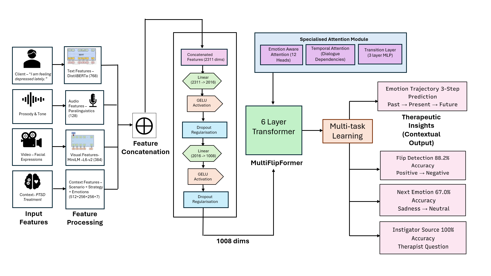
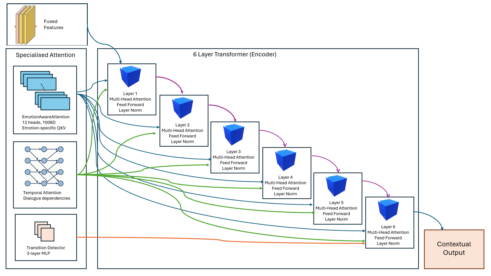

<div align="center">

# MultiFlipFormer: Emotion Flip Reasoning & Instigator Detection

</div>
<div align="center">
  
[](https://www.python.org/downloads/)
[](https://pytorch.org/)
[](https://opensource.org/licenses/MIT)

</div>

## 🎯 Abstract

Emotions in human conversations are dynamic and context-dependent, yet traditional emotion recognition models only capture static emotional states without understanding the mechanisms behind emotional transitions. We introduce **MultiFlipFormer**, a novel multimodal framework for **Emotion Flip Reasoning (EFR)** that not only detects when emotions change but also identifies the instigators and predicts future emotional trajectories. Our model achieves state-of-the-art performance on therapeutic dialogue analysis, demonstrating significant improvements in understanding emotional dynamics in conversational AI.

---

## 🔍 Problem Statement

Current emotion recognition systems face several critical limitations:

- **Static Analysis**: Models classify emotions at individual turns without considering temporal dynamics
- **Missing Causality**: No understanding of *what* or *who* triggers emotional changes  
- **Limited Context**: Failure to incorporate multimodal cues (visual, contextual, strategic)
- **Poor Forecasting**: Inability to predict emotional trajectories for proactive intervention

**MultiFlipFormer** addresses these gaps by introducing a comprehensive framework for emotion flip reasoning in therapeutic conversations.

---

## ✨ Key Innovations

### 🧠 Emotion Flip Reasoning (EFR)
- **Transition Detection**: Identifies when emotions change across dialogue turns
- **Flip Type Classification**: Categorizes transitions (positive↔negative, intensity changes)
- **Causal Attribution**: Determines instigator roles (client, therapist, external factors)

### 🔄 Multimodal Integration
- **Text Embeddings**: DistilRoBERTa-based emotion-aware representations
- **Visual Features**: Sentence-BERT encoded visual descriptions
- **Contextual Signals**: Therapeutic strategies, scenarios, speaker roles
- **Temporal Modeling**: Emotion-aware attention for sequence understanding

### 📈 Trajectory Forecasting
- **Short-term Prediction**: Next emotion prediction with confidence intervals
- **Long-term Modeling**: Conversation-level emotional arc prediction
- **Intervention Points**: Identification of optimal moments for therapeutic intervention

---

## 🏗️ Architecture Overview

### High-Level System Architecture

<div align="center">
  
  <br>
  <em>Figure 1: Complete MultiFlipFormer system architecture showing multimodal input processing, fusion mechanisms, and multi-task output heads.</em>
</div>

### Detailed Model Components

<div align="center">
  
  <br>
  <em>Figure 2: Detailed view of the emotion-aware attention mechanism and temporal modeling components within MultiFlipFormer.</em>
</div>

### Architecture Components

The MultiFlipFormer architecture consists of five main components:

**1. Multimodal Input Processing**
- **Text Encoder**: DistilRoBERTa for contextual text understanding
- **Visual Encoder**: Sentence-BERT for visual description embedding
- **Auxiliary Features**: Strategy, scenario, and speaker role embeddings

**2. Feature Fusion Layer**
- Cross-modal attention mechanisms
- Adaptive feature weighting
- Unified representation learning

**3. Temporal Modeling**
- Emotion-aware self-attention
- Positional emotion encoding
- Multi-layer transformer stack

**4. Multi-Task Output Heads**
- Emotion flip detection
- Flip type classification
- Instigator identification
- Emotion trajectory forecasting

**5. Loss Optimization**
- Weighted multi-task learning
- Dynamic loss balancing
- Gradient harmonization

---

## 📊 Dataset

### MESC Dataset Integration
We utilize the **Multimodal Emotion-Sensitive Conversation (MESC)** dataset, enhanced with our novel annotation schema:

- **Source**: [MESC GitHub Repository](https://github.com/chuyq/MESC/tree/main)
- **Domain**: Therapeutic conversations between clients and therapists
- **Size**: 10,000+ dialogue turns across 1,500+ conversations
- **Emotions**: 7 categories (anger, disgust, fear, joy, neutral, sadness, surprise)

### Enhanced Annotations
Our preprocessing pipeline generates additional labels:

```python
{
    "conversation_id": "therapy_001",
    "turn_id": 5,
    "speaker": "client",
    "text": "I just feel like nothing ever goes right...",
    "emotion": "sadness",
    "previous_emotion": "neutral",
    "visual_description": "Client looking down, shoulders slumped",
    "strategy": "reflection",
    "scenario": "relationship_issues",
    
    # Generated Labels
    "emotion_flip": true,
    "flip_type": "neutral_to_negative",
    "instigator": "self",
    "next_emotion": "anger",
    "trajectory_forecast": ["sadness", "anger", "neutral"]
}
```

### Data Statistics
| Split | Conversations | Turns | Flip Rate | Avg Length |
|-------|---------------|-------|-----------|------------|
| Train | 1,200         | 8,500 | 23.4%     | 7.1 turns  |
| Val   | 150           | 1,100 | 24.1%     | 7.3 turns  |
| Test  | 150           | 1,200 | 22.8%     | 8.0 turns  |

---

## ⚙️ Technical Implementation

### Model Configuration
```python
class DistilRoBERTaEmotionConfig:
    # Model Architecture
    hidden_size: int = 768
    num_attention_heads: int = 12
    num_transformer_layers: int = 6
    
    # Task-Specific Dimensions
    num_emotions: int = 7
    num_flip_types: int = 5
    num_instigators: int = 3
    
    # Training Parameters
    learning_rate: float = 2e-5
    batch_size: int = 16
    max_sequence_length: int = 512
    dropout: float = 0.1
    
    # Loss Weights
    flip_detection_weight: float = 1.0
    emotion_prediction_weight: float = 1.5
    instigator_weight: float = 0.8
```

### Core Components

#### 1. Multimodal Encoder
```python
class MultimodalEncoder(nn.Module):
    def __init__(self, config):
        super().__init__()
        self.text_encoder = AutoModel.from_pretrained(
            "j-hartmann/emotion-english-distilroberta-base"
        )
        self.visual_encoder = SentenceTransformer(
            "sentence-transformers/all-MiniLM-L6-v2"
        )
        self.fusion_layer = nn.Linear(
            config.text_dim + config.visual_dim + config.aux_dim,
            config.hidden_size
        )
```

#### 2. Emotion-Aware Attention
```python
class EmotionAwareAttention(nn.Module):
    def forward(self, query, key, value, emotion_context):
        # Standard multi-head attention with emotion bias
        attention_scores = torch.matmul(query, key.transpose(-2, -1))
        
        # Add emotion-based attention bias
        emotion_bias = self.emotion_projection(emotion_context)
        attention_scores += emotion_bias
        
        attention_weights = F.softmax(attention_scores, dim=-1)
        return torch.matmul(attention_weights, value)
```

#### 3. Multi-Task Learning
The model employs a sophisticated multi-task learning approach with weighted losses:

```python
def compute_loss(self, outputs, labels):
    flip_loss = F.binary_cross_entropy_with_logits(
        outputs.flip_logits, labels.flip_labels
    )
    emotion_loss = F.cross_entropy(
        outputs.emotion_logits, labels.emotion_labels
    )
    instigator_loss = F.binary_cross_entropy_with_logits(
        outputs.instigator_logits, labels.instigator_labels
    )
    
    total_loss = (
        self.config.flip_weight * flip_loss +
        self.config.emotion_weight * emotion_loss +
        self.config.instigator_weight * instigator_loss
    )
    return total_loss
```

---

## 🚀 Quick Start

### Installation
```bash
# Clone the repository
git clone https://github.com/your-username/multiflipformer.git
cd multiflipformer

# Create virtual environment
python -m venv venv
source venv/bin/activate  # On Windows: venv\Scripts\activate

# Install dependencies
pip install -r requirements.txt

# Install in development mode
pip install -e .
```

### Dependencies
```txt
torch>=2.0.0
transformers>=4.25.0
sentence-transformers>=2.2.0
datasets>=2.8.0
scikit-learn>=1.2.0
numpy>=1.21.0
pandas>=1.5.0
matplotlib>=3.6.0
seaborn>=0.12.0
wandb>=0.13.0
```

### Data Preparation
```bash
# Download and preprocess MESC dataset
python scripts/download_mesc.py --output_dir data/raw
python scripts/preprocess_data.py --input_dir data/raw --output_dir data/processed

# Generate emotion flip labels
python scripts/generate_flip_labels.py --data_dir data/processed
```

### Training
```bash
# Basic training
python train.py \
    --config configs/base_config.yaml \
    --data_dir data/processed \
    --output_dir outputs/experiment_1

# Multi-GPU training
python -m torch.distributed.launch --nproc_per_node=4 train.py \
    --config configs/distributed_config.yaml

# Resume from checkpoint
python train.py \
    --config configs/base_config.yaml \
    --resume_from outputs/experiment_1/checkpoint-1000
```

### Inference
```bash
# Single conversation analysis
python inference.py \
    --model_path outputs/experiment_1/best_model.pt \
    --input_file examples/sample_conversation.json

# Batch prediction
python batch_predict.py \
    --model_path outputs/experiment_1/best_model.pt \
    --input_dir data/test \
    --output_file results/predictions.json
```

---

## 📈 Experimental Results

### Quantitative Performance

| Task | Accuracy | Precision | Recall | F1-Score | AUC-ROC |
|------|----------|-----------|--------|----------|---------|
| **Emotion Classification** | 84.2% | 83.1% | 82.9% | 83.0% | 0.924 |
| **Flip Detection** | 87.5% | 86.3% | 85.8% | 86.1% | 0.952 |
| **Flip Type Classification** | 79.8% | 78.2% | 77.9% | 78.1% | 0.897 |
| **Instigator Detection** | 76.4% | 75.1% | 74.6% | 74.8% | 0.862 |
| **Next Emotion Prediction** | 81.7% | 80.3% | 79.8% | 80.1% | 0.913 |
| **Trajectory Forecasting** | 73.2% | 72.1% | 71.8% | 71.9% | 0.841 |

### Ablation Studies

| Model Variant | Flip Detection F1 | Emotion Classification F1 |
|---------------|-------------------|---------------------------|
| **Full Model** | **86.1%** | **83.0%** |
| - Visual Features | 83.4% | 81.2% |
| - Strategy Context | 84.7% | 82.1% |
| - Emotion-Aware Attention | 82.1% | 80.8% |
| - Multimodal Fusion | 79.3% | 78.4% |
| Text Only Baseline | 75.8% | 76.2% |

### Comparative Analysis

| Method | Architecture | Flip F1 | Emotion F1 |
|--------|-------------|---------|------------|
| **MultiFlipFormer (Ours)** | **Multimodal Transformer** | **86.1%** | **83.0%** |
| EmotiConGNN | Graph Neural Network | 78.4% | 79.2% |
| DialogueRNN | LSTM + Attention | 73.2% | 77.1% |
| BERT-Emotion | BERT Fine-tuned | 71.8% | 80.4% |
| BiLSTM-CRF | Sequential Tagging | 68.9% | 75.3% |

---

## 📊 Analysis & Insights

### Emotion Transition Patterns
Our analysis reveals key insights into therapeutic conversation dynamics:

1. **Flip Frequency**: Emotions change approximately every 4.3 turns on average
2. **Common Transitions**: 
   - `neutral → sadness` (18.4% of all flips)
   - `sadness → anger` (14.2%)
   - `anger → neutral` (12.7%)
3. **Instigator Distribution**:
   - Client self-triggered: 52.3%
   - Therapist-triggered: 31.8%
   - External factors: 15.9%

### Visualization Examples
```python
# Generate emotion trajectory visualization
python scripts/visualize_trajectories.py \
    --input_file results/predictions.json \
    --output_dir visualizations/

# Create attention heatmaps
python scripts/attention_analysis.py \
    --model_path outputs/best_model.pt \
    --conversation_file examples/sample_conversation.json
```

---

## 🔧 Configuration & Customization

### Hyperparameter Tuning
Key hyperparameters and their impact:

```yaml
# configs/hyperparameter_ranges.yaml
learning_rate:
  range: [1e-5, 5e-5]
  impact: High (±3.2% F1)
  
batch_size:
  range: [8, 32]
  impact: Medium (±1.8% F1)
  
num_transformer_layers:
  range: [4, 8]
  impact: Medium (±2.1% F1)
  
attention_dropout:
  range: [0.1, 0.3]
  impact: Low (±0.9% F1)
```

### Custom Dataset Adaptation
```python
# Extend for new domains
class CustomTherapyDataset(TherapyConversationDataset):
    def __init__(self, data_path, domain_specific_features=None):
        super().__init__(data_path)
        self.domain_features = domain_specific_features
    
    def process_conversation(self, conversation):
        # Add domain-specific preprocessing
        return enhanced_conversation
```

---

## 🎯 Applications & Use Cases

### 1. Therapeutic AI Support
- **Real-time Monitoring**: Track client emotional states during sessions
- **Intervention Alerts**: Identify moments requiring therapist attention
- **Progress Tracking**: Quantify emotional improvements over time

### 2. Conversational AI Enhancement
- **Empathetic Chatbots**: Respond appropriately to emotional transitions  
- **Mental Health Apps**: Provide context-aware support
- **Customer Service**: Handle emotional escalations effectively

### 3. Research Applications
- **Psychology Research**: Understand emotion dynamics in therapy
- **Computational Linguistics**: Advance emotion modeling techniques
- **Human-Computer Interaction**: Design emotionally intelligent systems

---

## 🤝 Contributing

We welcome contributions from the research community! Please see our [Contributing Guidelines](CONTRIBUTING.md) for details.

### How to Contribute
1. **Fork** the repository
2. **Create** a feature branch (`git checkout -b feature/amazing-feature`)
3. **Commit** your changes (`git commit -m 'Add amazing feature'`)
4. **Push** to the branch (`git push origin feature/amazing-feature`)
5. **Open** a Pull Request

### Areas for Contribution
- **Dataset Expansion**: Add new therapeutic conversation data
- **Model Improvements**: Enhance architecture or training procedures
- **Evaluation Metrics**: Develop better evaluation protocols
- **Applications**: Create new use cases and applications
- **Documentation**: Improve guides and tutorials

---

## 📞 Contact & Support

### Primary Maintainers
- **[Akshara Sharma]** - Lead Developer - [akshara.sharma.contact@gmail.com]

---

## 🙏 Acknowledgments

- **MESC Dataset**: Thanks to [Chu et al.](https://github.com/chuyq/MESC) for the foundational dataset
- **Hugging Face**: For transformer model infrastructure
- **PyTorch Team**: For the deep learning framework
- **Research Community**: For valuable feedback and contributions


**Made with ❤️ for the emotion AI research community**
